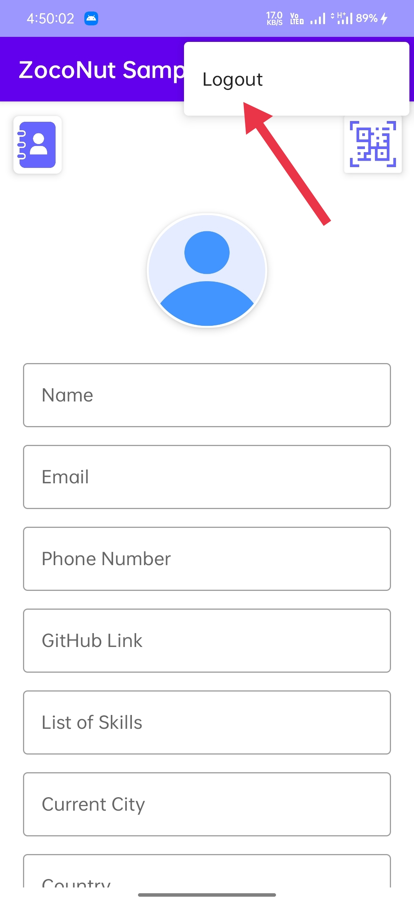

# ZocoNutSample App

#### Note: To run the app you have on the internet connectivity

#### Demo Images

SignIn Screen

SignUp Screen

Home Screen 

Home Screen (ContactList Button in Home Screen)

Home Screen (QR Scanner Button in Home Screen)

ContactList Screen (This data show using Firebase Sync Functionality)

QR Screen

Logout Option Screen

#### Libraries
- [Firebase](https://firebase.google.com/) For User Authentication & Google Sync Functionality
- [Glide](https://bumptech.github.io/glide/doc/download-setup.html) For Show Image From URL
- [Google gson](https://github.com/google/gson) For parsing JSON data
- [Coroutines](https://developer.android.com/kotlin/coroutines) For manage long-running tasks
