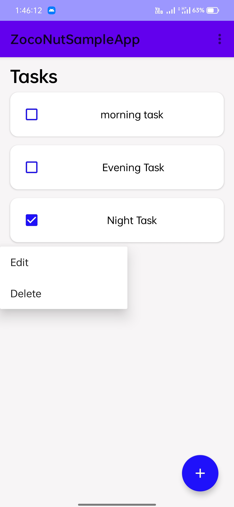

# ZocoNutSample App

#### Note: To run the app you have on the internet connectivity

#### Demo Images

SignIn Screen

SignUp Screen

Home Screen (This data show using Firebase Sync Functionality)

Add task Screen

Edit task Screen

PopMenu Screen

Logout Option Screen

#### Libraries
- [Firebase](https://firebase.google.com/) For User Authentication & Google Sync Functionality
- [Room](https://developer.android.com/training/data-storage/room) For Offline Local Database
- [Google gson](https://github.com/google/gson) For parsing JSON data
- [Coroutines](https://developer.android.com/kotlin/coroutines) For manage long-running tasks
